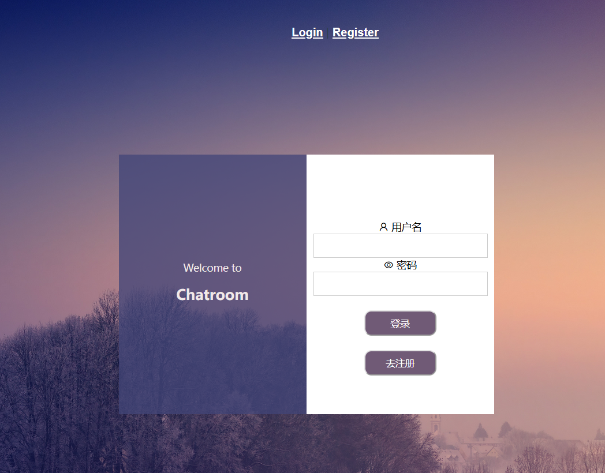

<h1><center>实验报告：在线聊天室实现
</h1>
<h5><center>李颖欣 20331020 	李安吉 20331054

## 一、简介

​		在线聊天室是一个经典的集网络通信与多线程并发的程序设计项目，本课程大作业考虑到两人组的工作量实现的OJ系统不如三人及以上组完善，因此考虑实现在线聊天室作为课程作业。基本实现了多人在线聊天、好友点对点在线聊天，好友离线记录存储收发等功能。


## 二、项目本地部署
项目地址：https://github.com/LeeAnnJ/rust_chatroom

本项目前后端分离：

​	前端基于 `vue2` +`vue-router`+`websocket`+`axios` 实现；

​	后端基于 `rust`+`actix-web`+`sqlx`+`mysql` 实现。


项目结构简略说明：

```c
chatroom
├─ client
├─ doc	// 接口说明
├─ server	// 后端部分(服务端)
├─ vue_chat		// 前端部分(客户端)
├─ .gitgnore	// 配置git可忽略的文件
└─ readme.md	// 实验报告
└─ 数据库Init.sql	// 数据库初始化文件    
```


### 1 数据库

​		采用`Mysql`数据库存储用户信息、好友关系、好友聊天记录等。

#### 1.1 数据库结构表简单说明

用户表 `users`

| 字段说明 | 字段名 | 字段类型 |
| -------- | ------ | -------- |
| 用户ID   | ID     | int      |
| 用户密码 | PW     | varchar  |
| 用户名   | uName  | varchar  |


消息表 `meslog`

| 字段说明 | 字段名 | 字段类型 |
| -------- | ------ | -------- |
| 信息ID   | mesID  | int      |
| 发送者ID | sID    | int      |
| 接收者ID | rID    | int      |
| 消息内容 | mes    | text     |
| 发送时间 | sTime  | datetime |
| 是否已读 | isread | int      |


好友表 `friends`

| 字段说明 | 字段名 | 字段类型 |
| -------- | ------ | -------- |
| 关系ID   | fID    | int      |
| 己方ID   | sID    | int      |
| 对方ID   | rID    | int      |


#### 1.2 数据库初始化

为了给数据库做一个统一配置，在数据库中创建用户：

```sql
CREATE USER 'TO-DO-LIST'@'localhost' IDENTIFIED WITH mysql_native_password BY '123456';
GRANT ALL PRIVILEGES ON *.* TO 'TO-DO-LIST'@'%';
```

在Mysql数据库创建SCHEMAS: chatroom，运行chatroom/数据库Init.sql，即可配置初始数据。


### 2 服务端

* 打开chatroom/server项目，点击server/.env文件，根据mysql创建的数据库配置相应路径。
* 运行server/main.rs的fn main()，启动服务端，端口为本地的8080。

​	若出现类似以下结果，即服务端启动成功。

```c
[2023-01-21T09:12:26Z INFO  server] starting HTTP server at http://127.0.0.1:8080
[2023-01-21T09:12:26Z INFO  actix_server::builder] Starting 2 workers
[2023-01-21T09:12:26Z INFO  actix_server::server] Actix runtime found; starting in Actix runtime
```


### 3 客户端

* 管理员身份运行命令行，进入到vue_chat项目，运行`cnpm install`配置模块；
* 运行`npm run build`，解决跨域问题；
* 终止并运行`npm run serve`，即可启动客户端；
* 客户端的端口为本地的8082，根据实际情况有所变化；
* 打开提示的网址：`http://localhost:8082/`即可打开客户端界面。

​	若出现类似以下结果，及客服端启动成功。

```c
  App running at:
  - Local:   http://localhost:8082/
  - Network: http://localhost:8082/
```


## 三、功能模块简介

### 基本功能
1. 使用网络通信完成客户端到服务器端、服务器端到客户端的信息交互。
2. 通过数据库存储支持聊天记录储存功能。
3. 客户端展示好友列表，并支持通过添加好友发起会话功能。
4. 使用多线程支持多人群聊和多会话并行处理功能。
4. 实现好友会话离线消息接收功能。


### 界面展示

登录界面




注册界面


登录后默认界面


好友聊天界面


个人信息及好友聊天记录模块

